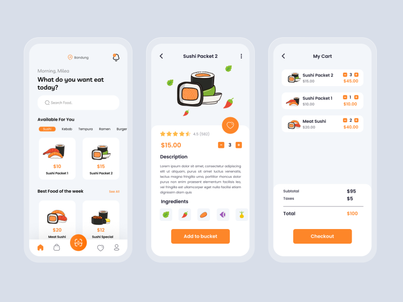
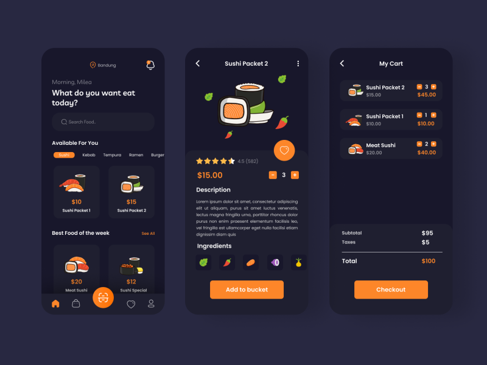
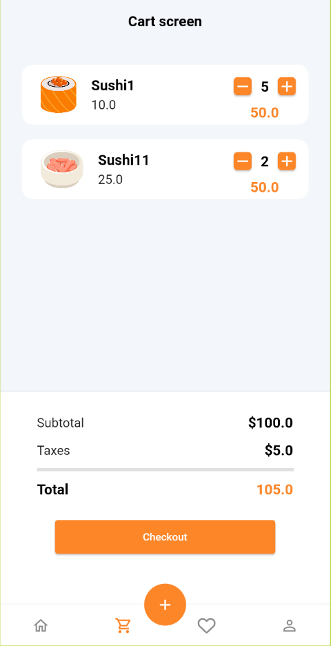
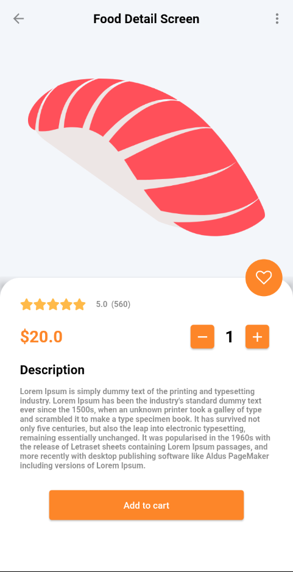
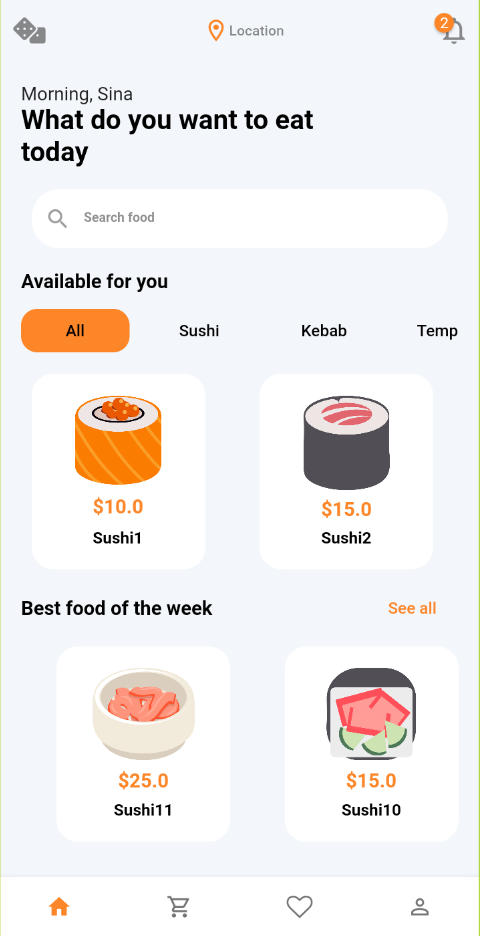
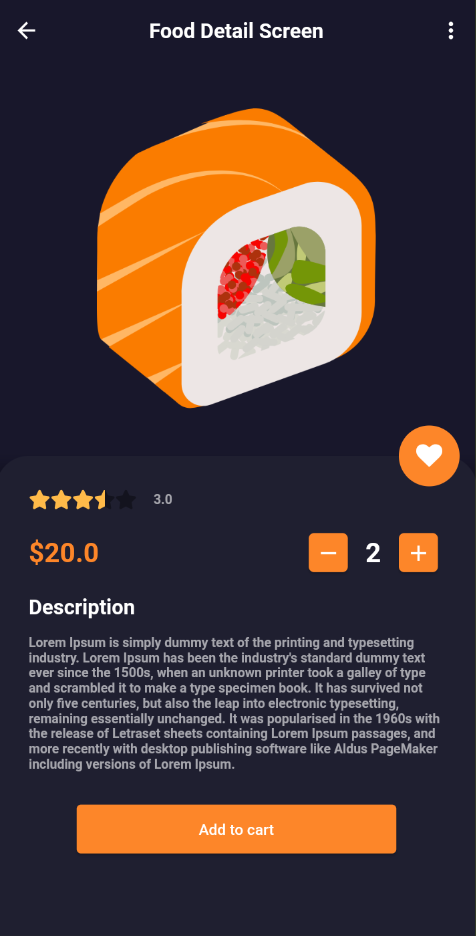
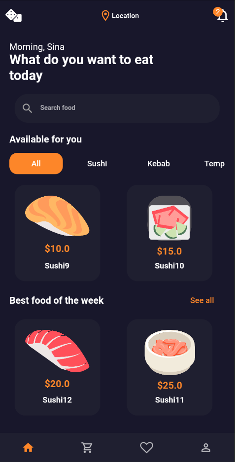
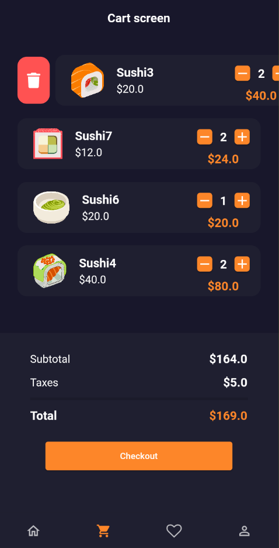
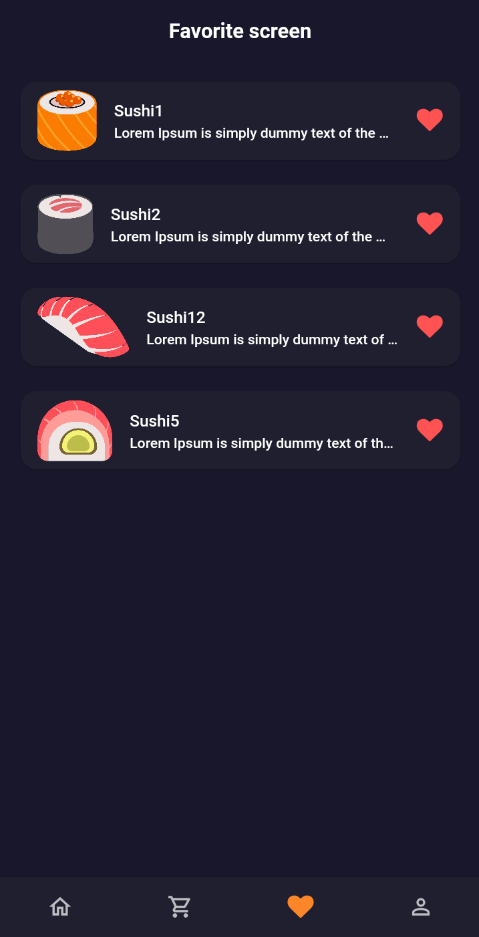

# 🍣 Flutter Japanese Restaurant  – UI Demo

A beautifully designed Flutter UI demo for a Japanese restaurant or food delivery app.  
This is a **UI-only** showcase built to highlight layout, design, and theme—no backend or dynamic functionality.

---

## 📱 Overview

The app includes a clean, modern interface with screens commonly found in food-related apps:

- Home screen with featured dishes  
- Food listing by category  
- Detailed product views  
- Cart and favorites pages  
- Light & dark mode support

---

## 🔍 Status

**Demo only** – This app contains no backend logic or working data connections.

---

## 🎞️ Preview

  

---

## 📸 Screenshots

<table>
  <tr>
    <td></td>
    <td></td>
  </tr>
  <tr>
        <td></td>
                <td></td>
                        <td></td>

  </tr>
  <tr>
        <td></td>
        <td></td>
    <td></td>
    <td></td>
  </tr>
</table>

---

## 📝 Notes

- Developed using Flutter  
- Structured with modular and reusable components  
- Great starting point for food delivery or restaurant app projects

---

## ✍️ Created by

**Mohamed Ebrahim**
